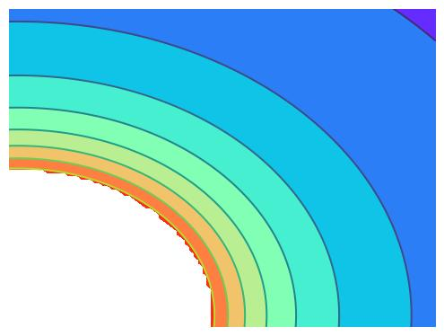

  <h1 align="center">Not-So-Deep Learning</h1>
    <h3 align="center">End-to-end implementation of a Convolutional Neural Network</h3>

 

    

<h2> </h2>
This mini-course offers an introduction to practical deep learning applications. Over three lectures, we'll delve into the fundamentals of Convolutional Neural Networks (CNNs) using PyTorch, guiding you through an end-to-end implementation process. Each lecture is designed towards understading basics of deep learning, with a duration of approximately 1 to 1.5 hours. By the end of this course, you'll have a basic understanding of CNNs and the skills to apply them in various real-world scenarios.

## Task
Our objective is to extract the flow profile of a radial flow based on images captured by a camera. These images are synthetically generated. The input image appears as follows:
 

 
Our goal is to understand and reproduce the corresponding flow profile, depicted below:
 

Remarkably, the CNN not only discerns the flow profile but also implicitly identifies the source's location.

## Preliminaries

Before we begin, let's ensure we've completed the following preparatory tasks:

1. **Clone the Git Repository**: Fetch the necessary codebase from the Git repository to access the required scripts and modules.
2. **Familiarize with Finding Minima**: Understand how to find minima of a one-variable function. For instance, explore functions like 'f(x) = x^2' or 'f(x) = x^3'.
3. **Install Python and Essential Packages**: Install Python along with essential packages like Torch, Torchvision, NumPy, and Matplotlib to facilitate deep learning operations.
4. **Execute 'hello_world.py'**: Run the 'hello_world.py' script to ensure that your environment is properly set up and functional.
5. **Identify a Problem for Deep Learning**: Have a problem in mind that you wish to solve using deep learning techniques. It doesn't necessarily have to be an original problem; it could be a simplified version of a problem outlined in a research paper. Focus primarily on formalizing the problem by addressing the following questions:
    1. Input Data: Determine the type of input data (e.g., images, texts, videos) required for your problem.
    2. Output Data: Identify the desired output format (e.g., images, texts, videos, numerical values).
    3. Dataset Size: Assess the number of available input-output pairs for training your model.
    4. Data Dimensions: Understand the dimensions of both input and output data.
    5. Understanding of Input-Output Relationship: Formulate a basic understanding or hypothesis regarding the relationship between input and output data. This could be a conjecture that requires validation through experimentation.

## Lecture 1
1. Example: Decide when to give loan as a bank
2. Example: Decide how much loan to give as a bank
3. Supervised and unsupervised learning, focus on Supervised learning
4. Loss functions
5. Minimization of loss functions: convex, nonconvex
6. Important aspects: initialization, learning rate
7. Perspective: Machine learning is a task to design good loss functions
8. What are artificial neural networks?
9. Overfitting, underfitting and benefits of cross validation
10. Not all data are the same? - preprocessing is important
11. Skewed datasets, badly scaled datasets
12. Make sure 'hello_world.py' runs

### Homework
Work on the problem (at least a toy version) of problem of your choice. If you do not have one in mind, then take the input images from the input folder and construct a CNN that figures out the coordianates of the source. You can use 'data/seed_pts.dat' as your output data for training/validation.

## Lecture 2
1. Introduction to CNN
2. Operators that help: kernel, stride, padding, maxpooling etc
3. Introduction to pytorch
4. Develop the CNN architecture for the problem: Autoencoders
5. Go through the code, line-by-line
6. Run the code for various learning rates
7. Plot beautiful images

## Lecture 3
1. Any queries?
2. Discussion on the homework problem
3. Issues and debugging
4. Why did it work or why did it not

## Useful references <a name="credits" />
1. CNN in pytorch: https://medium.com/thecyphy/train-cnn-model-with-pytorch-21dafb918f48
2. Autoencoders in pytorch: https://stackoverflow.com/questions/65260432/how-to-create-a-neural-network-that-takes-in-an-image-and-ouputs-another-image
3. Autoencoders for colorizing images: https://github.com/Keramatfar/image-colorizing-with-auto-encoder/blob/main/01.ipynb
4. PyTorch Syntax: https://youtu.be/n8Mey4o8gLc?si=ilVF1RRdZjZVEBNe

